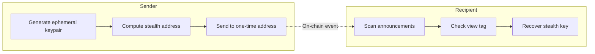
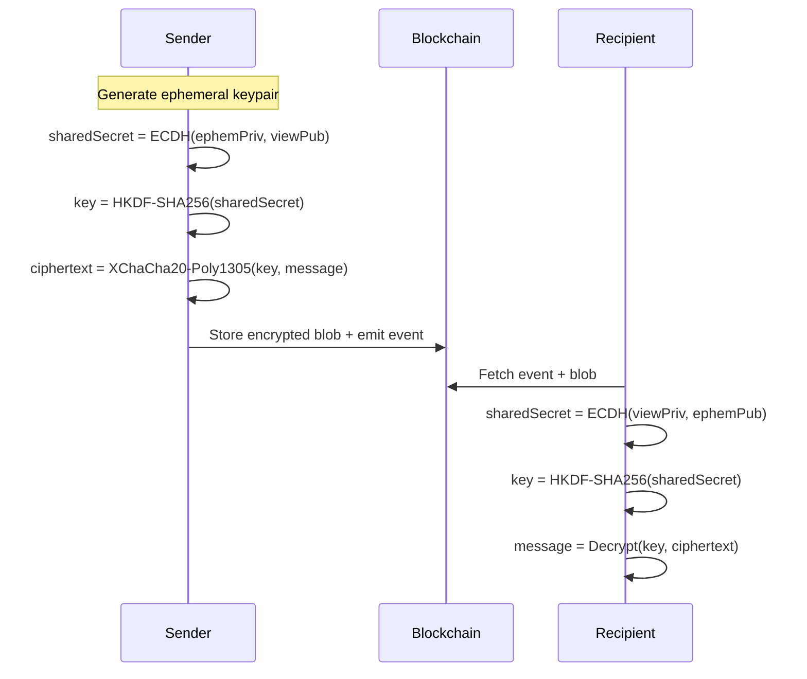
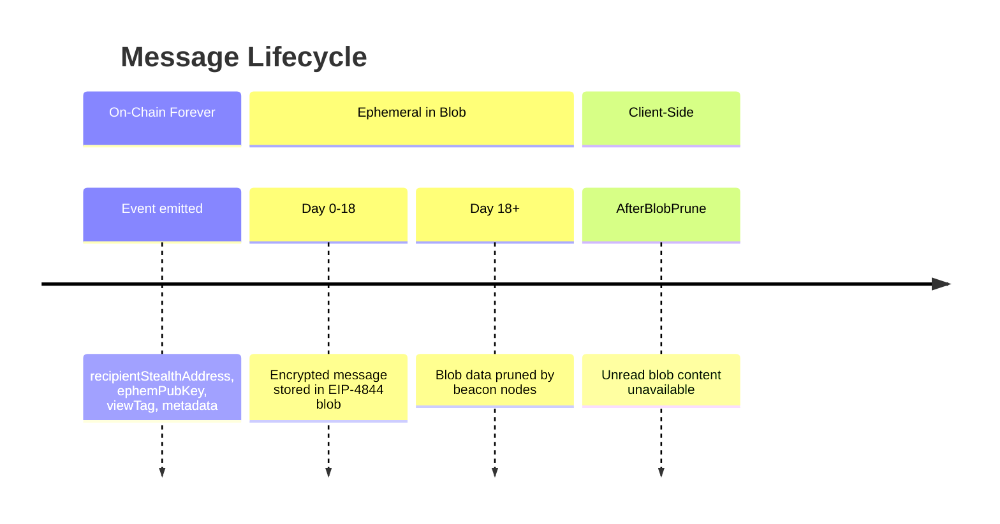

# Ephereum Chat Security Audit Report

**Date:** January 30, 2026  
**Version:** 1.0

## Executive Summary

Ephereum Chat is a privacy-preserving messaging application built on Ethereum. This audit analyzes the architecture to verify the following privacy claims:

| Requirement               | Status  | Notes                                                                    |
| ------------------------- | ------- | ------------------------------------------------------------------------ |
| Recipient privacy         | Partial | Stealth addresses hide the true recipient, but metadata reveals patterns |
| Only receiver can decrypt | Strong  | Cryptographically enforced via secp256k1 ECDH + XChaCha20-Poly1305       |
| Message ephemerality      | Strong  | Blob data pruned after ~18 days; only metadata remains on-chain          |

---

## Table of Contents

1. [Recipient Privacy Analysis](#1-recipient-privacy-analysis)
2. [Encryption Security Analysis](#2-encryption-security-analysis)
3. [Message Ephemerality Analysis](#3-message-ephemerality-analysis)
4. [Encryption Explained for Non-Technical Users](#4-encryption-explained-for-non-technical-users)
5. [Audit Findings Summary](#5-audit-findings-summary)
6. [Recommended Improvements](#6-recommended-improvements)
7. [Client-Side Security (XSS Protection)](#7-client-side-security-xss-protection)

---

## 1. Recipient Privacy Analysis

### How Stealth Addresses Work



**Privacy Mechanism:**

- Each message uses a **unique one-time stealth address** derived from the recipient's meta-address
- The stealth address is generated using an ephemeral keypair that changes per message
- Only the recipient (with their `viewPrivKey` and `spendPrivKey`) can link the stealth address to themselves

**Key Code** ([stealth.ts](../apps/web/src/modules/stealth/stealth.ts)):

```typescript
// Sender derives a unique stealth address per message
const stealthPoint = spendPubPoint.add(secp.Point.BASE.multiply(tweak));
const stealthAddress = toEthAddress({
  uncompressedPubKey: stealthPoint.toRawBytes(false),
});
```

### Privacy Risks Identified

| Risk                   | Severity | Details                                                       |
| ---------------------- | -------- | ------------------------------------------------------------- |
| Metadata leakage       | Low      | Minimal metadata (`version`, `payloadHash`) is visible on-chain |
| View tag correlation   | Low      | 1-byte tag enables fast filtering but doesn't reveal identity |
| Sender address visible | High     | `msg.sender` of the transaction is public                     |
| Transaction patterns   | Medium   | Timing, frequency, and batch sends can be analyzed            |

**Recommendation:** Use a relayer or mixer service to hide the sender's main address when calling `announce()`.

---

## 2. Encryption Security Analysis

### Encryption Flow



### Why Only the Recipient Can Decrypt

The encryption relies on **Elliptic Curve Diffie-Hellman (ECDH)**:

1. **Shared secret derivation**: Only two parties can compute the same shared secret:

   - Sender: `sharedSecret = ECDH(ephemPrivKey, recipientViewPubKey)`
   - Recipient: `sharedSecret = ECDH(recipientViewPrivKey, ephemPubKey)`

2. **Key derivation**: The symmetric key is derived via HKDF:

```typescript
// From encryption.ts
const key = hkdf(sha256, sharedSecret, salt, info, 32);
```

3. **Encryption**: XChaCha20-Poly1305 provides:
   - **Confidentiality**: 256-bit encryption
   - **Integrity**: Poly1305 authentication tag
   - **Forward secrecy**: Each message uses a new ephemeral key

**Cryptographic Primitives Used:**

| Primitive            | Algorithm          | Purpose                                       |
| -------------------- | ------------------ | --------------------------------------------- |
| Key agreement        | secp256k1 ECDH     | Derive shared secret (same curve as Ethereum) |
| Key derivation       | HKDF-SHA256        | Derive symmetric key from shared secret       |
| Symmetric encryption | XChaCha20-Poly1305 | AEAD encryption with authentication           |

### Security Assessment

| Property        | Status | Implementation                   |
| --------------- | ------ | -------------------------------- |
| Forward secrecy | Strong | New ephemeral key per message    |
| Authentication  | Strong | Poly1305 MAC                     |
| Key derivation  | Strong | HKDF with context binding        |
| Nonce handling  | Strong | 24-byte random nonce per message |

**The encryption is cryptographically sound.** An attacker would need the recipient's `viewPrivKey` to decrypt messages.

---

## 3. Message Ephemerality Analysis

### Blob Lifecycle



### What Remains Permanent vs Ephemeral

**Permanent (On-Chain Forever):**

- `recipientStealthAddress` (indexed)
- `ephemeralPubKey` (33 bytes)
- `viewTag` (1 byte)
- `metadata` JSON containing:
  - `version`
  - `payloadHash`
- Transaction hash, block number, timestamp

**Ephemeral (~18 days):**

- Encrypted message content (in blob)
- Nonce (24 bytes)
- Ciphertext + auth tag

**Key Code** ([constants.ts](../apps/web/src/modules/stealth/constants.ts)):

```typescript
// EIP-4844 blob retention period (~18 days)
export const BLOB_RETENTION_MS = 18 * 24 * 60 * 60 * 1000;
```

### Ephemerality Assessment

| Aspect                 | Status | Details                                  |
| ---------------------- | ------ | ---------------------------------------- |
| Message content        | Strong | Encrypted payload deleted after ~18 days |
| Metadata               | Medium | Minimal metadata (`version`, `payloadHash`) remains forever |
| Proof of communication | Weak   | Event log proves a message was sent      |

**Important:** Even though the message content cannot be recovered after blob pruning, an observer can still prove:

- A message was sent to a stealth address at a specific time
- The sender's Ethereum address (from transaction)
- The `payloadHash` metadata value

---

## 4. Encryption Explained for Non-Technical Users

### How It Works (Simple Explanation)

Imagine you want to send a secret letter to someone, but you don't want anyone to know who you're sending it to or what it says.

**Step 1: The Magic Mailbox (Stealth Addresses)**

Instead of sending to someone's real address, you create a special one-time mailbox just for this letter. Only the recipient has the magic key to open mailboxes made for them. You throw away your copy of the mailbox key after creating it.

**Step 2: The Secret Handshake (Key Exchange)**

Before writing your letter, you and the recipient do a special "secret handshake" through math. You both end up with the same secret number, but:

- You never share the number directly
- Nobody watching can figure it out
- Even if someone intercepts the handshake, they can't recreate it

**Step 3: The Invisible Ink (Encryption)**

You use the secret number to write your letter in invisible ink. Only someone with the same secret number can make the writing visible again. The ink also has a special seal - if anyone tampers with the letter, the recipient will know.

**Step 4: The Disappearing Paper (Blob Storage)**

Your encrypted letter is written on special paper that dissolves after about 2 weeks. During those 2 weeks:

- The recipient can get the letter and read it (using their magic key)
- Anyone else just sees scrambled nonsense
- After 2 weeks, the paper is gone forever

**What Stays Behind:**

Even though the letter disappears, there's a note in the post office saying "Someone sent a letter to mailbox #12345 on January 30th." But since mailbox #12345 is a one-time address, nobody knows it belongs to your friend unless they have the magic key.

### Visual Summary

```
Your Message: "Hey, let's meet at 5pm"
                    |
                    v
    +---------------------------+
    |     ENCRYPTION MAGIC      |
    |  (Secret handshake key)   |
    +---------------------------+
                    |
                    v
Encrypted: "0x7f8a2b...c9e1" (looks like random garbage)
                    |
                    v
    +---------------------------+
    |    STORED IN BLOB         |
    |   (Disappears in ~18 days)|
    +---------------------------+
                    |
                    v
Only recipient can read it back:
    "Hey, let's meet at 5pm"
```

### Answering Key Questions

**Q: Can anyone see who I'm sending messages to?**

A: No. Each message goes to a unique one-time address. Only the recipient can recognize that the address belongs to them. However, the sender's Ethereum address is visible unless you use a relayer service.

**Q: Can anyone read my messages?**

A: No. Messages are encrypted with military-grade encryption (XChaCha20-Poly1305). Only the recipient, who holds the private "view key," can decrypt and read the message.

**Q: Are messages stored forever?**

A: No. The actual message content is stored in a special type of Ethereum data called a "blob" that automatically gets deleted after approximately 18 days. After that, the message content is gone forever - not even the recipient can retrieve it.

**Q: What information IS permanent?**

A: Only the "envelope" information stays on the blockchain:

- That a message was sent
- When it was sent
- The one-time mailbox address (which nobody can link to the real recipient)
- Minimal metadata (`version` and `payloadHash`)

Think of it like: "Someone sent a letter to PO Box #12345 on January 30th" - but nobody knows who owns PO Box #12345.

---

## 5. Audit Findings Summary

### Strengths

1. **Strong cryptography**: Industry-standard primitives (secp256k1, XChaCha20-Poly1305, HKDF)
2. **Forward secrecy**: New ephemeral key per message prevents bulk decryption
3. **Recipient privacy**: Stealth addresses effectively hide the true recipient
4. **Message ephemerality**: Blob pruning ensures content cannot be recovered after ~18 days
5. **No server**: Fully client-side, no centralized point of failure

### Weaknesses and Recommendations

| Issue                  | Risk   | Recommendation                                        |
| ---------------------- | ------ | ----------------------------------------------------- |
| Sender address visible | High   | Implement relayer service or use a mixer              |
| Metadata exposed       | Medium | Consider encrypting metadata or using hashes only     |
| Payload hash linkage   | Medium | Use relayers/batching to reduce cross-transaction correlation |
| Fixed HKDF salt        | Low    | Acceptable since ephemeral keys ensure unique secrets |
| No AAD in encryption   | Low    | Consider binding metadata to ciphertext               |

### Security Guarantees

**What the current implementation guarantees:**

- Message content is end-to-end encrypted
- Only the recipient can decrypt messages
- Message content is deleted after ~18 days
- The recipient's real address is not revealed on-chain

**What the current implementation does NOT guarantee:**

- Sender anonymity (use a relayer)
- Metadata privacy (`payloadHash` remains public)
- Deniability (events prove messages were sent)
- Perfect forward secrecy against view key compromise

---

## 6. Recommended Improvements

### High Priority

1. **Relayer integration**: Hide sender address by using a relayer service
2. **Keep metadata minimal**: Avoid adding plaintext fields beyond `version` and `payloadHash`

### Medium Priority

3. **Batch announcements**: Send multiple messages in one transaction to reduce timing correlation
4. **Randomize timing**: Add delays to obscure message patterns

### Low Priority

5. **Add AAD**: Bind metadata hash to ciphertext for integrity
6. **View key rotation**: Allow rotating view keys without changing spend keys

---

## 7. Client-Side Security (XSS Protection)

### The Attack Vector

A potential attack could work like this:

1. Attacker sends a message containing malicious JavaScript: `<script>stealPrivateKeys()</script>`
2. Recipient fetches the blob and decrypts it
3. The decrypted content contains the malicious code
4. **If rendered unsafely**, the script could execute in the browser

### Current Protection Status: SAFE

The application uses React's default JSX rendering, which **automatically escapes** all content:

```typescript
// InboxPanel.tsx - Safe rendering
<p className='inbox-panel__value'>{message.content}</p>
```

This means malicious content is displayed as text, not executed:

| Malicious Input                    | What Gets Rendered        |
| ---------------------------------- | ------------------------- |
| `<script>alert('hacked')</script>` | Displayed as literal text |
| ``   | Displayed as literal text |
| `javascript:alert(1)`              | Just text, not executable |

### Attack Flow (Blocked)

```
Attacker's message: "<script>stealPrivateKeys()</script>"
                           |
                           v
                  [Blob Storage]
                           |
                           v
                  [Decryption] -> JSON.parse()
                           |
                           v
              content = "<script>stealPrivateKeys()</script>"
                           |
                           v
              React: {message.content}
                           |
                           v
              HTML: &lt;script&gt;stealPrivateKeys()&lt;/script&gt;
                           |
                           v
                    DISPLAYED AS TEXT (safe)
```

### Dangerous Patterns to Avoid

The following patterns must **never** be used with user-controlled content:

| Dangerous Pattern                               | Risk Level | Description                 |
| ----------------------------------------------- | ---------- | --------------------------- |
| `dangerouslySetInnerHTML={{ __html: content }}` | Critical   | Direct HTML injection       |
| `element.innerHTML = content`                   | Critical   | Bypasses React escaping     |
| `eval(content)`                                 | Critical   | Arbitrary code execution    |
| `new Function(content)()`                       | Critical   | Arbitrary code execution    |
| `<a href={content}>`                            | High       | `javascript:` URL injection |
| Markdown renderers without sanitization         | High       | Can embed scripts           |

### Audit Result

| Check                           | Status |
| ------------------------------- | ------ |
| No `dangerouslySetInnerHTML`    | Pass   |
| No `innerHTML` assignments      | Pass   |
| No `eval()` on user content     | Pass   |
| No `Function()` on user content | Pass   |
| React JSX escaping used         | Pass   |

**Conclusion:** The current implementation is protected against XSS attacks. Decrypted message content is treated as plain text and cannot execute as code.

### Recommendations for Future Development

1. **Never use `dangerouslySetInnerHTML`** with decrypted content
2. **If adding rich text/markdown support**, use a sanitization library like DOMPurify
3. **If adding link detection**, validate URLs don't start with `javascript:`
4. **Add Content Security Policy (CSP) headers** when deploying to production

---

## Appendix: Technical Specifications

### Cryptographic Parameters

| Parameter      | Value                  |
| -------------- | ---------------------- |
| Curve          | secp256k1              |
| Key size       | 256 bits               |
| Nonce size     | 192 bits (24 bytes)    |
| Auth tag size  | 128 bits (16 bytes)    |
| HKDF hash      | SHA-256                |
| HKDF context   | "stealth-chat-v1"      |
| Blob retention | ~18 days (4096 epochs) |

### Contract Addresses (Sepolia)

| Contract                            | Address                                      |
| ----------------------------------- | -------------------------------------------- |
| ERC-6538 Registry                   | `0x6538E6bf4B0eBd30A8Ea093027Ac2422ce5d6538` |
| MessageEnvelopeRegistry (announcer) | `0xe42A8d79AE1e4bbA02F753c592C43941f442c9A7` |

### Referenced Files

| File                                                                        | Purpose                        |
| --------------------------------------------------------------------------- | ------------------------------ |
| [stealth.ts](../apps/web/src/modules/stealth/stealth.ts)                    | Stealth address derivation     |
| [encryption.ts](../apps/web/src/modules/crypto/encryption.ts)               | XChaCha20-Poly1305 encryption  |
| [payload.ts](../apps/web/src/modules/messages/payload.ts)                   | Message encryption/decryption  |
| [metadata.ts](../apps/web/src/modules/messages/metadata.ts)                 | Announcement metadata encoding |
| [constants.ts](../apps/web/src/modules/stealth/constants.ts)                | Protocol constants             |
| [MessageEnvelopeRegistry.sol](../contracts/src/MessageEnvelopeRegistry.sol) | On-chain announcement contract |
